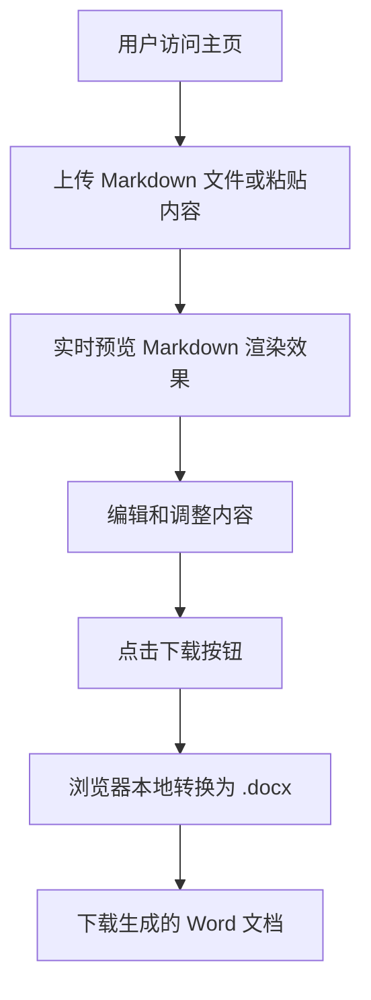
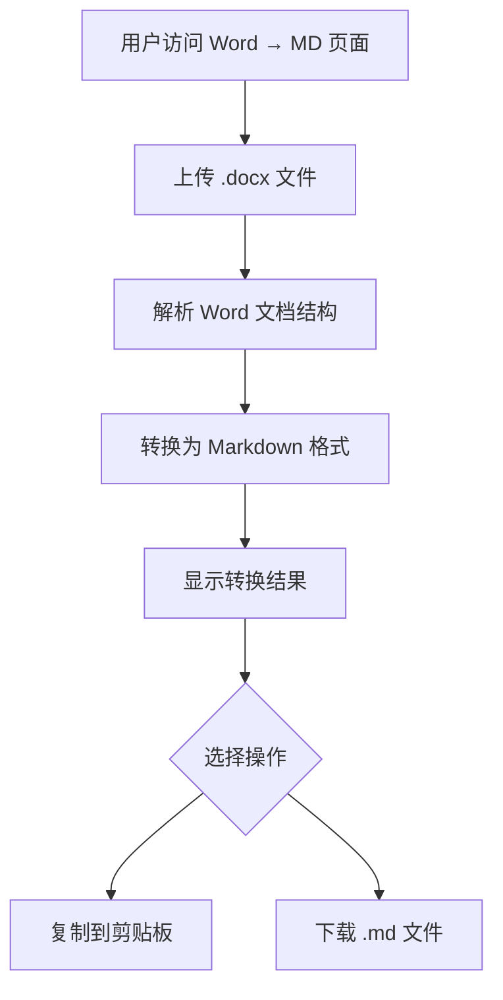
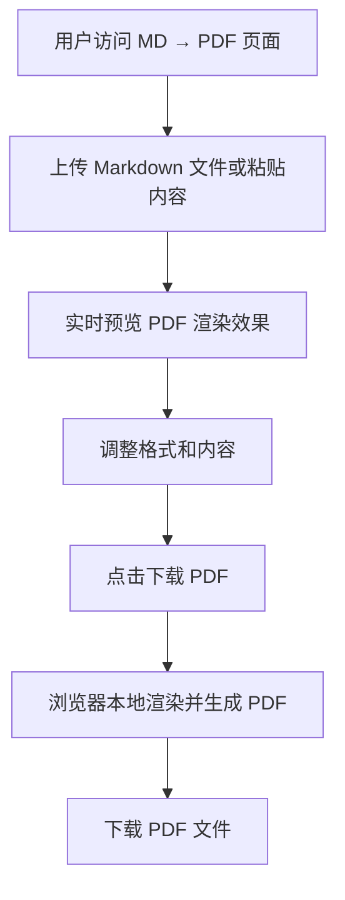
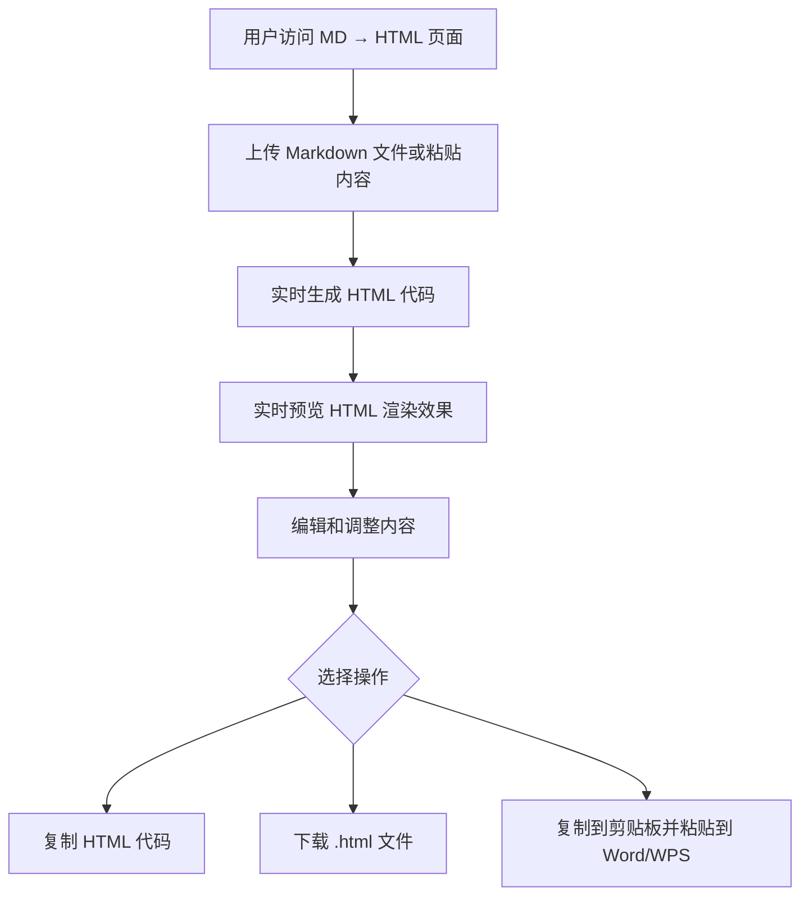
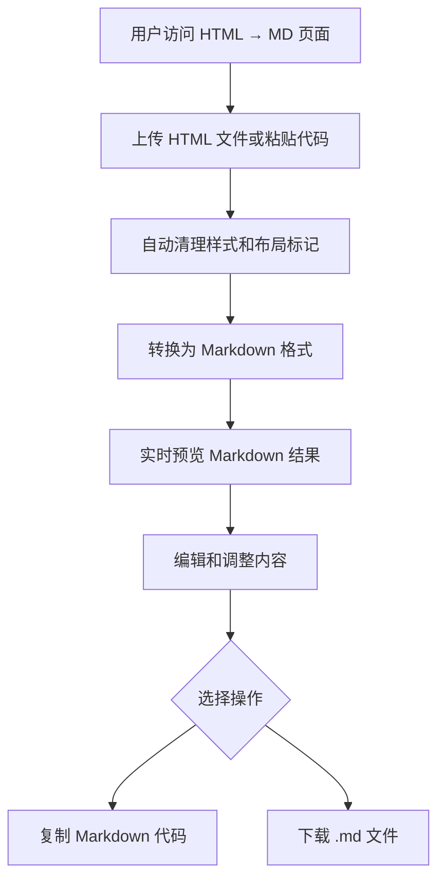
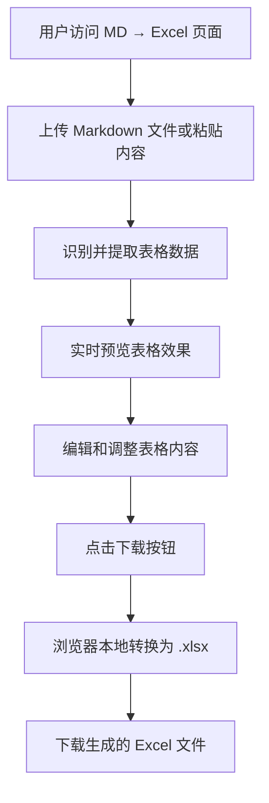

# 产品需求文档 (PRD)

## 1. 产品概述
这是一个纯前端的文档格式转换工具网站，提供 Markdown、Word、HTML、PDF、Excel 之间的互转功能。所有转换都在浏览器本地完成，保护用户隐私。参考 markdowntoword.io 的设计风格，提供简洁、现代的用户界面。

**目标用户**：内容创作者、技术文档工程师、学生、项目经理等需要频繁进行文档格式转换的用户。

**核心价值**：零安装、零上传、零费用，即开即用的文档转换服务。

## 2. 核心功能

### 2.1 功能模块
网站包含以下6大核心转换功能：

1. **Markdown 转 Word** - 主页，上传 Markdown 文件或粘贴内容，转换为 .docx 格式
2. **Word 转 Markdown** - 上传 .docx 文件，转换为 Markdown 格式
3. **Markdown 转 HTML** - 上传 Markdown 文件或粘贴内容，转换为 HTML 格式
4. **HTML 转 Markdown** - 上传 HTML 文件或粘贴代码，转换为 Markdown 格式
5. **Markdown 转 PDF** - 上传 Markdown 文件或粘贴内容，转换为 PDF 格式
6. **Markdown 转 Excel** - 上传 Markdown 文件或粘贴内容，将表格数据转换为 .xlsx 格式

### 2.2 页面详情

| 页面名称 | 模块名称 | 功能描述 |
|---------|---------|---------|
| 主页（MD → Word） | 文件上传区 | 支持拖拽上传 .md 文件，最大10MB，或直接粘贴内容 |
| | Markdown 编辑器 | 实时编辑 Markdown 内容，支持语法高亮 |
| | 实时预览区 | 实时渲染 Markdown 为 HTML 预览 |
| | 下载按钮 | 一键下载转换后的 .docx 文件 |
| Word → Markdown | 文件上传区 | 支持拖拽上传 .docx 文件，最大10MB |
| | 转换结果展示 | 显示转换后的 Markdown 内容 |
| | 复制/下载 | 支持复制到剪贴板或下载 .md 文件 |
| MD → HTML | 文件上传区 | 支持拖拽上传 .md/.markdown/.txt 文件 |
| | 双栏布局 | 左侧 Markdown 编辑，右侧 HTML 代码和预览 |
| | 复制功能 | 支持复制 HTML 代码或直接粘贴到 Word/WPS |
| HTML → Markdown | 文件上传区 | 支持拖拽上传 .html/.htm/.txt 文件 |
| | 双栏布局 | 左侧 HTML 编辑，右侧 Markdown 结果 |
| | 清理功能 | 自动清理 HTML 中的样式和布局标记 |
| MD → PDF | 文件上传区 | 支持拖拽上传 .md 文件，最大5MB |
| | 实时预览 | 显示 PDF 渲染效果预览 |
| | 下载 PDF | 一键下载生成的 PDF 文件 |
| MD → Excel | 文件上传区 | 支持拖拽上传 .md 文件，最大10MB |
| | Markdown 编辑器 | 实时编辑 Markdown 内容，支持表格语法 |
| | 表格预览 | 显示表格数据预览效果 |
| | 下载 Excel | 一键下载转换后的 .xlsx 文件 |

### 2.3 通用功能特性
- **拖拽上传**：所有页面支持文件拖拽上传
- **粘贴内容**：支持从剪贴板直接粘贴内容
- **实时预览**：编辑内容时实时更新预览效果
- **本地处理**：所有转换在浏览器本地完成，不上传服务器
- **文件大小限制**：Markdown 文件最大10MB，PDF 转换最大5MB
- **响应式设计**：支持桌面端和移动端访问

## 3. 核心流程

### 3.1 Markdown 转 Word 流程

### 3.2 Word 转 Markdown 流程

### 3.3 Markdown 转 PDF 流程

### 3.4 Markdown 转 HTML 流程

### 3.5 HTML 转 Markdown 流程

### 3.6 Markdown 转 Excel 流程

## 4. 用户界面设计

### 4.1 设计风格
**整体风格**：参考 markdowntoword.io，采用简洁、现代、专业的设计风格

- **主色调**：
  - 主色：蓝色系 (#3B82F6) - 信任、专业
  - 辅色：深灰色 (#1F2937) - 文字内容
  - 背景：浅灰色 (#F9FAFB) - 页面背景
  - 强调色：绿色 (#10B981) - 成功状态

- **字体方案**：
  - 标题字体：Inter 或系统默认无衬线字体，粗体，清晰易读
  - 正文字体：Inter，常规字重，14-16px
  - 代码字体：JetBrains Mono 或 Fira Code，等宽字体

- **按钮样式**：
  - 主按钮：圆角 (8px)，蓝色背景，悬停时加深颜色
  - 次按钮：圆角，白色背景，灰色边框
  - 文件上传区域：虚线边框，拖拽时高亮显示

- **布局风格**：
  - 顶部固定导航栏，包含 Logo 和功能菜单
  - 主内容区采用居中布局，最大宽度 1200px
  - 双栏布局：左侧编辑器，右侧预览区
  - 卡片式设计：功能区块使用白色背景卡片，带阴影

- **图标风格**：
  - 使用 Lucide React 图标库
  - 线性图标，统一粗细
  - 功能性图标：文件、下载、上传、转换等

### 4.2 页面设计概览

| 页面名称 | 模块名称 | UI 元素 |
|---------|---------|---------|
| 导航栏 | Logo | 左上角，品牌标识，可点击返回主页 |
| | 功能菜单 | 水平导航，包含所有转换功能链接 |
| | 语言切换 | 右上角，支持中英文切换 |
| 主页 | Hero 区域 | 标题、副标题、简介文字 |
| | 上传区域 | 虚线边框卡片，拖拽提示文字 |
| | 编辑器区 | 左侧代码编辑器，带语法高亮 |
| | 预览区 | 右侧实时预览，Markdown 渲染结果 |
| | 操作按钮 | 下载按钮，主按钮样式 |
| 页脚 | 版权信息 | 底部居中，隐私保护说明 |

### 4.3 响应式设计
- **桌面优先**：主要针对桌面端设计，提供最佳体验
- **平板适配**：双栏布局在小屏幕上调整为单栏堆叠
- **移动端优化**：简化界面，保留核心功能，优化触摸操作

### 4.4 交互动画
- **页面加载**：淡入效果，组件依次显示
- **文件上传**：拖拽时边框高亮，上传进度指示
- **按钮悬停**：颜色渐变，轻微上浮效果
- **转换过程**：加载动画，状态提示

## 5. 技术约束

### 5.1 前端技术栈
- **框架**：React 18 + TypeScript
- **构建工具**：Vite
- **样式方案**：Tailwind CSS
- **状态管理**：Zustand
- **路由管理**：React Router DOM

### 5.2 核心依赖库
- **docx**：生成 Word 文档
- **mammoth**：解析 .docx 文件
- **marked**：Markdown 转 HTML
- **turndown**：HTML 转 Markdown
- **jspdf + html2canvas**：Markdown 转 PDF
- **exceljs** 或 **xlsx (SheetJS)**：生成 Excel 文件
- **lucide-react**：图标库

### 5.3 性能要求
- **首次加载**：< 3 秒（在 3G 网络下）
- **转换速度**：小文件（< 1MB）< 2 秒完成转换
- **文件大小限制**：Markdown 文件 10MB，PDF 转换 5MB

### 5.4 浏览器兼容性
- 支持现代浏览器：Chrome 90+、Firefox 88+、Safari 14+、Edge 90+
- 不支持 IE 浏览器

## 6. 隐私和安全

### 6.1 隐私保护
- 所有文件处理在浏览器本地完成，不上传到服务器
- 不收集用户数据，不记录转换内容
- 关闭页面后，所有临时数据自动清除

### 6.2 安全措施
- 前端文件大小限制，防止恶意大文件
- 输入内容验证，防止注入攻击
- HTTPS 加密传输（部署后）

## 7. 未来扩展

### 7.1 可能的新功能
- 批量文件转换
- 自定义样式模板
- 转换历史记录（本地存储）
- 更多格式支持（如 RTF、ODT）
- API 接口供开发者调用

### 7.2 优化方向
- 大文件转换性能优化
- 转换质量提升（复杂表格、公式）
- 离线使用支持（PWA）