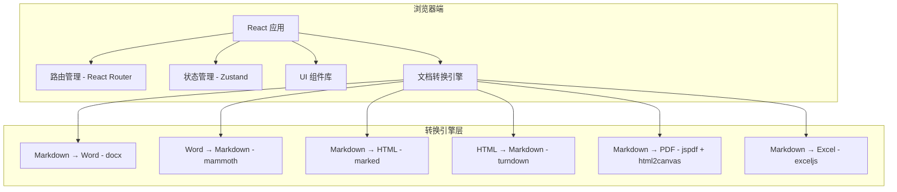
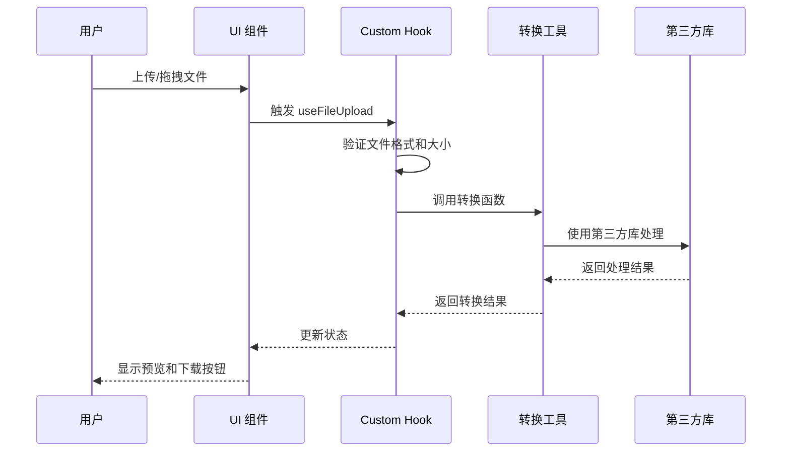

# 技术架构文档

## 1. 架构设计

本项目采用纯前端架构，所有文档转换处理都在浏览器端完成，无需后端服务器。



## 2. 技术说明

### 2.1 前端技术栈

* **框架**：React 18.3 + TypeScript 5.4

* **构建工具**：Vite 5.4

* **样式方案**：Tailwind CSS 3.4

* **状态管理**：Zustand 4.5

* **路由管理**：React Router DOM 6.26

* **包管理器**：pnpm（优先）或 npm

### 2.2 核心依赖库

| 库名                     | 版本       | 用途                 |
| ---------------------- | -------- | ------------------ |
| docx                   | ^8.5.0   | 生成 Word 文档    |
| mammoth                | ^1.8.0   | 解析 .docx 文件        |
| marked                 | ^12.0.0  | Markdown 转 HTML    |
| turndown               | ^7.2.0   | HTML 转 Markdown    |
| jspdf                  | ^2.5.1   | 生成 PDF 文档          |
| html2canvas            | ^1.4.1   | HTML 转图片（PDF 生成辅助） |
| exceljs                | ^4.4.0   | 生成 Excel 文件 |
| lucide-react           | ^0.400.0 | 图标库                |
| file-saver             | ^2.0.5   | 文件下载               |

### 2.3 开发工具

* **代码规范**：ESLint + TypeScript ESLint

* **类型检查**：TypeScript strict mode

* **构建优化**：Vite 自动分包和压缩

## 3. 路由定义

| 路由路径                | 页面名称            | 功能描述                    |
| ------------------- | --------------- | ----------------------- |
| `/`                 | 主页              | Markdown 转 Word，默认首页    |
| `/word-to-markdown` | Word 转 Markdown | 上传 .docx 文件转换为 Markdown |
| `/markdown-to-html` | Markdown 转 HTML | Markdown 转 HTML 代码      |
| `/html-to-markdown` | HTML 转 Markdown | HTML 转 Markdown 格式      |
| `/markdown-to-pdf`  | Markdown 转 PDF  | Markdown 转 PDF 文档       |
| `/markdown-to-excel`| Markdown 转 Excel| Markdown 转 Excel 文件      |

## 4. 项目结构

```
markdown转化/
├── public/              # 静态资源
├── src/
│   ├── components/      # 可复用组件
│   │   ├── layout/      # 布局组件
│   │   │   ├── Header.tsx
│   │   │   └── Footer.tsx
│   │   ├── common/      # 通用组件
│   │   │   ├── FileUploader.tsx
│   │   │   ├── Editor.tsx
│   │   │   └── Preview.tsx
│   │   └── converters/  # 转换功能组件
│   │       ├── MdToWord.tsx
│   │       ├── WordToMd.tsx
│   │       ├── MdToHtml.tsx
│   │       ├── HtmlToMd.tsx
│   │       ├── MdToPdf.tsx
│   │       └── MdToExcel.tsx
│   ├── pages/           # 页面组件
│   │   ├── Home.tsx
│   │   ├── WordToMarkdown.tsx
│   │   ├── MarkdownToHtml.tsx
│   │   ├── HtmlToMarkdown.tsx
│   │   ├── MarkdownToPdf.tsx
│   │   └── MarkdownToExcel.tsx
│   ├── hooks/           # 自定义 Hooks
│   │   ├── useFileUpload.ts
│   │   ├── useMarkdownProcessor.ts
│   │   └── useExcelProcessor.ts
│   ├── utils/           # 工具函数
│   │   ├── converters/  # 转换工具
│   │   │   ├── mdToWord.ts
│   │   │   ├── wordToMd.ts
│   │   │   ├── mdToHtml.ts
│   │   │   ├── htmlToMd.ts
│   │   │   ├── mdToPdf.ts
│   │   │   └── mdToExcel.ts
│   │   └── fileUtils.ts
│   ├── store/           # Zustand 状态管理
│   │   └── useStore.ts
│   ├── App.tsx          # 应用入口
│   ├── main.tsx         # 渲染入口
│   └── index.css        # 全局样式
├── package.json
├── tsconfig.json
├── vite.config.ts
├── tailwind.config.js
└── postcss.config.js
```

## 5. 组件设计

### 5.1 核心组件

#### FileUploader 组件

```typescript
interface FileUploaderProps {
  acceptedFormats: string[];      // 接受的文件格式
  maxSize: number;                // 最大文件大小（字节）
  onFileSelect: (file: File) => void;  // 文件选择回调
  onFileDrop: (file: File) => void;    // 文件拖拽回调
}
```

#### Editor 组件

```typescript
interface EditorProps {
  content: string;                // 编辑器内容
  language: 'markdown' | 'html';  // 语言类型
  onChange: (value: string) => void;  // 内容变更回调
}
```

#### Preview 组件

```typescript
interface PreviewProps {
  content: string;                // 预览内容
  type: 'markdown' | 'html' | 'pdf'; // 预览类型
}
```

### 5.2 转换工具函数

#### Markdown 转 Word

```typescript
// utils/converters/mdToWord.ts
import { Document, Packer, Paragraph, TextRun, HeadingLevel } from 'docx';

export async function convertMarkdownToWord(markdown: string): Promise<Blob> {
  // 1. 解析 Markdown 结构
  // 2. 构建 docx 文档对象
  // 3. 生成 Blob 并返回
}
```

#### Word 转 Markdown

```typescript
// utils/converters/wordToMd.ts
import mammoth from 'mammoth';

export async function convertWordToMarkdown(file: File): Promise<string> {
  // 1. 读取 .docx 文件
  // 2. 使用 mammoth 解析
  // 3. 返回 Markdown 字符串
}
```

#### Markdown 转 PDF

```typescript
// utils/converters/mdToPdf.ts
import { jsPDF } from 'jspdf';
import html2canvas from 'html2canvas';
import { marked } from 'marked';

export async function convertMarkdownToPdf(markdown: string): Promise<Blob> {
  // 1. Markdown 转 HTML
  // 2. HTML 渲染到临时 DOM
  // 3. 使用 html2canvas 生成图片
  // 4. jspdf 创建 PDF 并添加图片
  // 5. 返回 PDF Blob
}
```

#### Markdown 转 Excel

```typescript
// utils/converters/mdToExcel.ts
import ExcelJS from 'exceljs';

export async function convertMarkdownToExcel(markdown: string): Promise<Blob> {
  // 1. 解析 Markdown 中的表格数据
  // 2. 使用 ExcelJS 创建工作簿
  // 3. 将表格数据写入工作表
  // 4. 生成 Excel Blob 并返回
}
```

## 6. 状态管理

### 6.1 全局状态（Zustand）

```typescript
// store/useStore.ts
import { create } from 'zustand';

interface AppState {
  // 当前编辑的内容
  content: string;
  setContent: (content: string) => void;

  // 上传的文件信息
  uploadedFile: File | null;
  setUploadedFile: (file: File | null) => void;

  // 转换结果
  convertedResult: string | Blob | null;
  setConvertedResult: (result: string | Blob | null) => void;

  // 加载状态
  isConverting: boolean;
  setIsConverting: (status: boolean) => void;
}
```

## 7. 数据流设计

### 7.1 文件转换流程



## 8. 性能优化策略

### 8.1 加载优化

* **代码分包**：按路由分割代码，懒加载非核心页面

* **依赖优化**：大型库（如 jspdf、mammoth）按需加载

* **资源压缩**：Vite 自动压缩 JS/CSS

### 8.2 运行时优化

* **虚拟滚动**：大文件编辑器使用虚拟滚动

* **防抖处理**：实时预览使用防抖，避免频繁渲染

* **Web Worker**：大文件转换使用 Web Worker 后台处理

### 8.3 内存管理

* **及时清理**：转换完成后清理临时 DOM 元素

* **Blob 处理**：大文件使用 Blob URL 而非 Base64

## 9. 错误处理

### 9.1 错误类型

* **文件格式错误**：不支持的文件格式

* **文件大小超限**：超过最大限制

* **转换失败**：解析或生成错误

* **浏览器兼容性**：不支持的浏览器特性

### 9.2 错误提示

* **用户友好**：清晰的错误消息和解决建议

* **日志记录**：console.error 记录详细错误（开发模式）

* **降级方案**：部分功能失败时提供替代方案

## 10. 测试策略

### 10.1 单元测试

* 使用 Vitest 测试转换工具函数

* 测试各种边界情况和错误处理

### 10.2 集成测试

* 测试完整的转换流程

* 验证文件上传、转换、下载流程

### 10.3 E2E 测试

* 使用 Playwright 测试用户操作流程

* 验证跨浏览器兼容性

## 11. 部署方案

### 11.1 静态部署

本项目为纯前端应用，可部署到任何静态文件托管服务：

* **Vercel**：推荐，自动 CI/CD

* **Netlify**：支持表单处理

* **GitHub Pages**：免费，适合开源项目

* **Cloudflare Pages**：全球 CDN 加速

### 11.2 构建命令

```bash
pnpm build   # 构建生产版本
pnpm preview # 本地预览构建结果
```

## 12. 开发计划

### 12.1 开发阶段

1. **阶段一**：项目初始化和基础架构搭建
2. **阶段二**：实现核心转换功能（MD → Word, Word → MD）
3. **阶段三**：完善其他转换功能
4. **阶段四**：UI 美化和交互优化
5. **阶段五**：测试和性能优化
6. **阶段六**：部署上线

### 12.2 优先级

* **P0（必须）**：基础框架、MD → Word、Word → MD

* **P1（重要）**：MD → HTML、HTML → MD、MD → PDF、MD → Excel

* **P2（可选）**：高级编辑功能、性能优化

